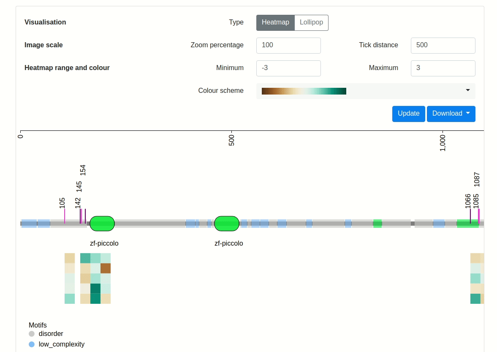
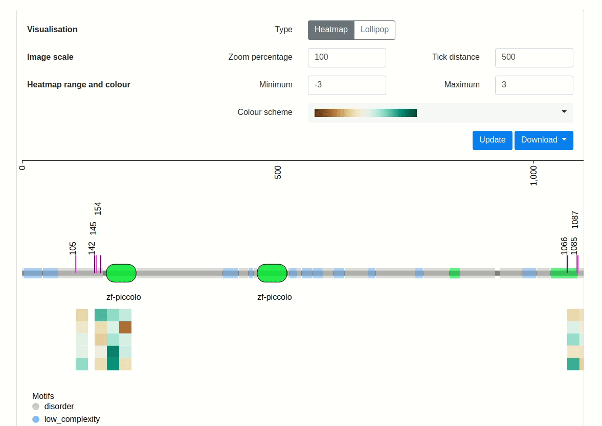
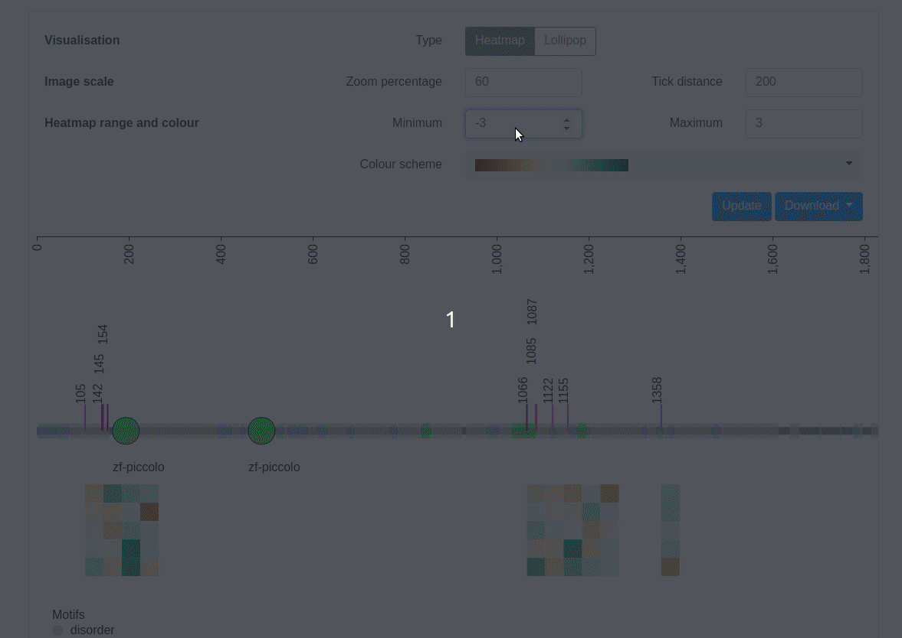

## How to use PTM Mapper

### Protein Entry Name or Accession

Specify a protein of interest using the UniProt entry name or accession (for example, BSN_RAT or O88778). Proteins entries are restricted to the UniProt release currently being used by Pfam, which provides the evolutionarily conserved domain information.

A single value may be specified. For example:

```
BSN_RAT
```

More than one protein can be displayed by separating the values with a comma.

```
BSN_RAT,TAU_RAT
```

A valid UniProt entry must be supplied in this field.

### Post-translational modifications file

Your post-translational modification site information must be provided via a file in CSV (comma-separated value) format. The application will use this information for display on the evolutionarily conserved protein domain structure diagram.

The first line of the CSV file should be a header which identifies the information which can be found in each column. Each following line will define a new peptide datum and optional information on how the information is displayed and quantitative data.

|Column name|Required|Description|
|:-|:-|:-|
|`accession`|Yes|The protein entry name or accession code where this markup belongs. If the accession value specified in the CSV file does not match any accession in the diagram, the markup will not be drawn.|
|`start`|Yes|A semicolumn-delimited list of integers representing the sites of the modification on the peptide. For example: `110`, or `110;122;140`.|
|`type`|Yes|A semicolon-delimited list of strings representing the type of modification on the peptide. For example: `phosphorylation`, or `phosphorylation;glycosylation`.|
|`lineColour`||A semicolon-delimited list of strings representing the colour used to draw the modification. The colour can be any valid HTML colour name or hexadecimal. For example: `purple`, `purple;red`, or `lightcoral;#AA00FF`.If unspecified, a random colour will be assigned to each unique value specified in `type` column.|
|`intensity_*`||A single numerical value to quantify the amount of modification on the peptide. Intensity columns will be processed in the order in which they are specified. This column may be repeated as many times as necessary for each set of heatmap values.|

Here is a short example of a CSV file which includes only the required fields.

```
accession,start,type
tau_rat,105,phosphorylation
tau_rat,189;200,phosphorylation;glycosylation
```

Here is a quick example of another CSV file which includes all fields.

```
accession,start,type,lineColour,intensity_trial_1,intensity_trial_2,intensity_trial_3,intensity_trial_4,intensity_trial_5
tau_rat,105,phosphorylation,#FE4EDA,1.437837,0.9898816,0.1745114,0.4425308,0.09422488
tau_rat,130;140,phosphorylation,#FE4EDA,-0.8414064,-0.4202376,0.2043132,0.1221804,0.9935178
```

Notice that in the second peptide data row, there are many modification sites listed, however only one type and lineColour is specified. In cases like these, the type and lineColour values will be repeated for all modification sites specified on that line.

[Download an example CSV file](/example-csv) to experiment with the schema. This example CSV will generate [this view](/example).

### Drawing options

Options for changing the appearance of the drawing will appear after you click the 'Visualise' button. To reflect any changes in the drawing options form, you must click on the 'Update' button.

#### Visualisation

Quantitative markup data can be viewed as either heatmaps or as lollipops. For the heatmap view, each protein will be drawn once and experimental trials will appear as rows on the heatmap below each protein. For the lollipop view, each protein will be repeated for each experimental trial.



#### Image scale

You can scale the image and the distance between tick marks under the 'image scale' options. By default, the application draws the protein at 1 pixel per amino acid residue (100%).



#### Heatmap range and colour

'Heatmap range' and 'heatmap colour' allow you to adjust the heatmap range and colour scheme.



## Contact us

For any enquiries, please send us an email to [questions@cmri.org.au](mailto:questions@cmri.org.au).
