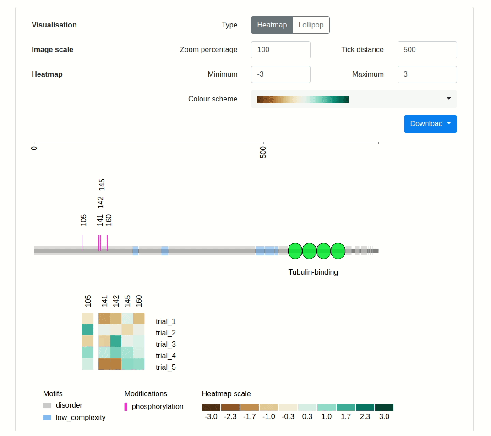
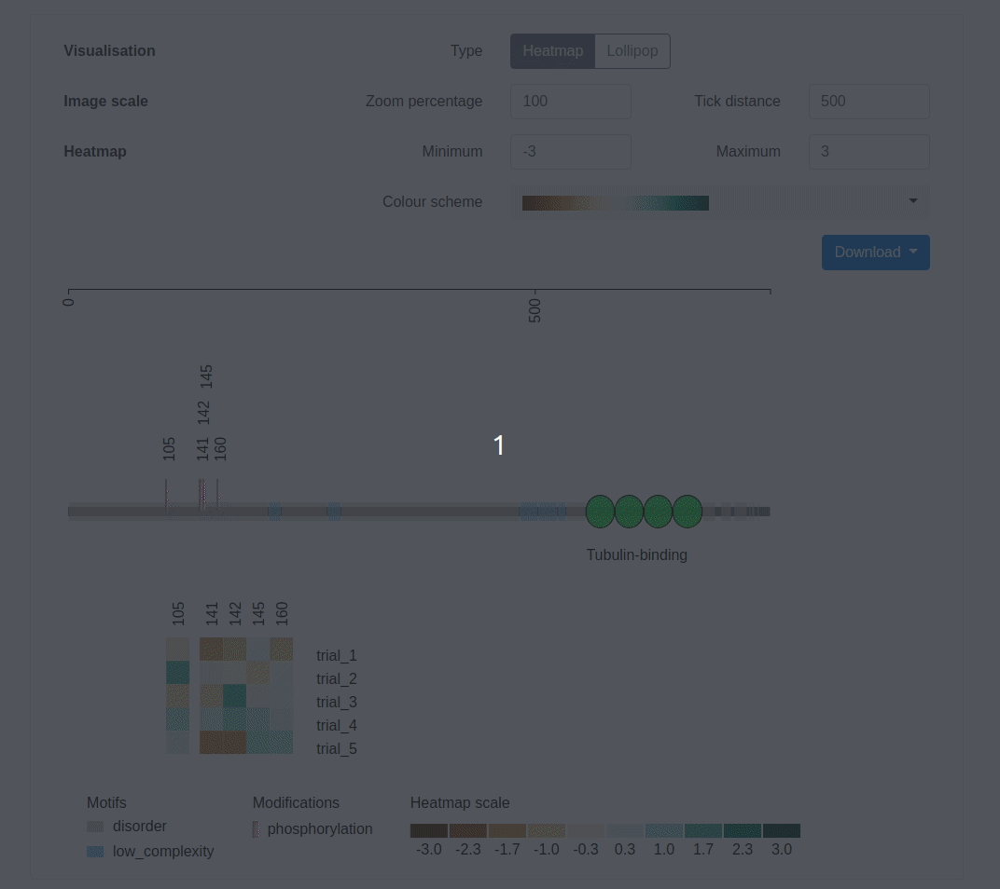

## How to use PTM VisQuant

### Protein Entry Name or Accession

Specify a protein of interest using the UniProt entry name or accession (for example, BSN_RAT or O88778). Proteins entries are restricted to the UniProt release currently being used by Pfam, which provides the evolutionarily conserved domain information.

A single value may be specified. For example:

```
BSN_RAT
```

More than one protein can be displayed by separating the values with a comma.

```
BSN_RAT,TAU_RAT
```

A valid UniProt entry must be supplied in this field.

### Post-translational modifications file

Your post-translational modification site information must be provided via a file in CSV (comma-separated value) format. The application will use this information for display on the evolutionarily conserved protein domain structure diagram.

The first line of the CSV file should be a header which identifies the information which can be found in each column. Each following line will define a new peptide datum and optional information on how the information is displayed and quantitative data.

|Column name|Required|Description|
|:-|:-|:-|
|`accession`|Yes|The protein entry name or accession code where this markup belongs. If the accession value specified in the CSV file does not match any accession in the diagram, the markup will not be drawn.|
|`start`|Yes|A semicolumn-delimited list of integers representing the sites of the modification on the peptide. For example: `110`, or `110;122;140`.|
|`type`|Yes|A semicolon-delimited list of strings representing the type of modification on the peptide. For example: `phosphorylation`, or `phosphorylation;glycosylation`.|
|`lineColour`||A semicolon-delimited list of strings representing the colour used to draw the modification. The colour can be any valid HTML colour name or hexadecimal. For example: `purple`, `purple;red`, or `lightcoral;#AA00FF`.If unspecified, a random colour will be assigned to each unique value specified in `type` column.|
|`intensity_*`||A single numerical value to quantify the amount of modification on the peptide. Intensity columns will be processed in the order in which they are specified. This column may be repeated as many times as necessary for each set of heatmap values.|

Here is a short example of a CSV file which includes only the required fields.

```
accession,start,type
tau_rat,105,phosphorylation
tau_rat,189;200,phosphorylation;glycosylation
```

Here is a quick example of another CSV file which includes all fields.

```
accession,start,type,lineColour,intensity_trial_1,intensity_trial_2,intensity_trial_3,intensity_trial_4,intensity_trial_5
syn3_rat,118,phosphorylation,#FE4EDA,1.437837,0.9898816,0.1745114,0.4425308,0.09422488
syn3_rat,130;140,phosphorylation;phosphorylation,#FE4EDA;#FE4EDA,-0.8414064,-0.4202376,0.2043132,0.1221804,0.9935178
```

If `type` and `lineColour` is consistent across many modifications on a peptide, they only need to be specified once.

```
accession,start,type,lineColour
syn1_rat,240;287;290,phosphorylation,lightgreen
```

In the example above, there are many modification sites listed, however only one type and lineColour is specified. In cases like these, the type and lineColour values will be repeated for all modification sites specified on that line.

[Download an example CSV file](/example-csv) to experiment with the schema. This example CSV will generate [this view](/example).

### Viewing and saving your visualisation

In the web application, you can hover your mouse over the heatmap cells or lollipop bulbs to display more information about a specific datum. This is useful for larger jobs where the labels may appear off-screen. Coordinate labels can be repositioned by clicking and dragging the text.


You have the option to customise the drawing in the options pane above the visualisation. See the section 'Drawing options' below for more information.

To download the visualisation as a static image, click the 'download' button below the drawing options pane, then select the output format.


Formats include:

* PNG, with white background
* PNG, with transparent background
* SVG

*QUICK TIP:* For jobs large jobs which display many proteins down the page, your horizontal scrollbar may be positioned off your screen. You can still scroll left and right by holding down the SHIFT key and scrolling with your mouse.

### Drawing options

Options for changing the appearance of the drawing will appear after you click the 'Visualise' button.

#### Visualisation

Quantitative markup data can be viewed as either heatmaps below the protein or as lollipops stemming from the protein backbone.



In heatmap view, each protein will be drawn once and experimental trials will appear as rows on the heatmap below each protein. In lollipop view, each protein will be repeated for each experimental trial. Trial labels appear on the far right side of the protein in both visualisation modes.

#### Image scale

You can horizontally scale the image and the distance between tick marks under the 'image scale' options. By default, the application draws the protein at 1 pixel per amino acid residue (100%) and draws a tick on the scale axis every 500 amino acid residues.



#### Heatmap

'Minimum' and 'maximum' options allow you to adjust the heatmap range. The 'colour scheme' options allows you to choose from a variety of diverging and sequential colour scales to visualise your data.


#### Lollipop

You can increase or decrease the heights of the lollipops by adjusting the 'scale height' setting. The 'tick distance' option will allow you to customise the distance between the tick marks on the lollipop height axis.

By default, the lollipops are coloured as they appear in the heatmap view. You can choose to colour the lollipops based on whether they are upregulated (positive intensity) or downregulated (negative intensity) by selecting the 'colour' checkbox.


## Contact us

For further enquiries, please email us at [questions@cmri.org.au](mailto:questions@cmri.org.au).
